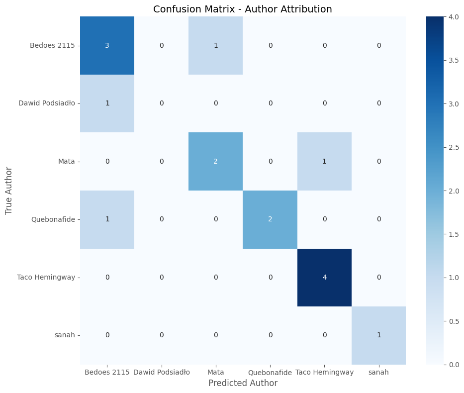
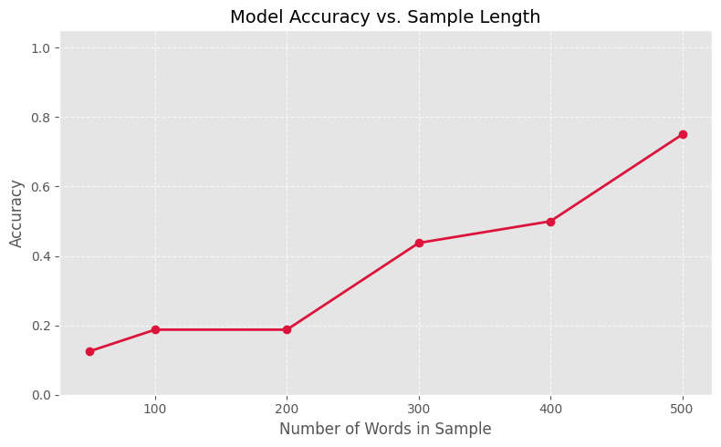

# Atrybucja Autorstwa (Adversarial Stylometry)

## Opis Problemu i Tematyka
Celem projektu jest zbudowanie modelu zdolnego odgadnąć autora tekstu na podstawie jego unikalnych cech stylometrycznych. Model został wytrenowany do rozpoznawania tekstów popularnych polskich artystów: Taco Hemingway, sanah, Bedoes 2115, Dawid Podsiadło, Mata, Quebonafide.

System wykorzystuje metody NLP oraz Regresje Logistyczną. Pozwala to na zbadanie **podświadomych nawyków językowych** twórców. Oznacza to, że klasyfikator nie skupia się na tym, *o czym* piszą autorzy, ale *jak* to robią, analizując m.in.:
* Częstotliwość używania słów funkcyjnych (spójniki, zaimki),
* Średnią długość zdań,
* Rozkład poszczególnych części mowy (np. stosunek czasowników do przymiotników),
* N-gramy znakowe łapiące specyficzne końcówki i zbitki liter.

Projekt składa się z:
1. **Atrybucja Stylometryczna:** Budowa modelu zdolnego klasyfikować teksty
2. **Adversarial Attack (Atak Lingwistyczny):** Sprawdzenie modelu poprzez stworzenie tekstów mających na celu imitować twórców

## Architektura Rozwiązania i Struktura Projektu

### Struktura Repozytorium
```text
ADVERSARIALSTYLOMETRY/
├── data/
│   ├── raw/                 # Surowe dane pobrane z API
│   └── processed/           # Oczyszczone i podzielone próbki tekstów
├── models/                  # Zapisane modele (.joblib)
├── images/                  # Screeny wizualizacji
├── data_download.py         # Integracja z Genius API i pobranie danych
├── data_cleaning.py         # Data cleaniing i cięcie tekstów na 500-słowowe próbki
├── features.py              # Ekstrakcja cech
├── text_processor.py        # Funkcją ekstrakcji
├── train.py                 # Definicja Pipeline'u scikit-learn i trening modeli
├── app.py                   # Aplikacja webowa i interfejs GUI (Streamlit)
├── eda.ipynb                # Notatnik Jupyter do generowania wykresów
├── requirements.txt         # Lista do reprodukcji środowiska
└── README.md                # Dokumentacja projektu
```

### Etapy projektu

**Pozyskanie danych**
* Pobrano teksty 6 popularnych polskich twórców.
* **Technologie:** `lyricsgenius`.

**Oczyszczanie i segmentacja**
* Usunięto znaczniki (np. [Chorus]) oraz nadmiarowe znaki.
* Zgrupowano wszystkie teksy.
* Podzielono tekst na równe próbki o długości 500 słów.
* **Technologie:** `pandas`, `re` (wyrażenia regularne).

**Ekstrakcja cech stylometrycznych**
* Przeprowadzono analizę lingwistyczną NLP każdej próbki tekstu.
* Obliczono średnią długość zdań.
* Policzono poszczególne części mowy (POS).
* Obliczono częstotliwość występowania najpopularniejszych słów funkcyjnych.
* Przygotowano wariant danych pozbawionych rzeczowników do eksperymentu kontrolnego.
* **Technologie:** `spaCy` (model `pl_core_news_sm`).

**Transformacja cech i modelowanie**
* Zbudowano (Pipeline).
* Surowy tekst przekształcono na n-gramy znakowe (zakres 2-4 znaki).
* Wyodrębnione wcześniej cechy numeryczne poddano standaryzacji.
* Wytrenowano model.
* **Technologie:** `scikit-learn` (`ColumnTransformer`, `TfidfVectorizer`, `StandardScaler`, `LogisticRegression`).

**Interaktywna aplikacja**
* Zbudowano aplikację webową.
* Zbudowano mechanizm wyciągania najważniejszych cech decyzyjnych modelu dla wklejonego tekstu.
* Zbudowano mechanizm wizualizacji wyników 
* **Technologie:** `Streamlit`, `matplotlib`, `joblib`.

## Instrukcja uruchomienia

Projekt został przygotowany w sposób umożliwiający szybkie odtworzenie środowiska i uruchomienie aplikacji.

**Wymagania wstępne**
* Python (wersja 3.9 lub nowsza).
* Narzędzie **Git**.

**Pobranie repozytorium**
* Sklonuj projekt na swój dysk lokalny i przejdź do folderu głownego.
```bash
git clone [TUTAJ_WKLEJ_LINK_DO_SWOJEGO_REPOZYTORIUM_GITHUB]
cd AdversarialStylometry
```

**Konfiguracja środowiska wirtualnego**
* Utwórz izolowane środowisko, aby uniknąć konfliktów z globalnymi pakietami.
* Aktywuj środowisko.
```bash
# Tworzenie środowiska
python -m venv .venv

# Aktywacja (Windows)
.venv\Scripts\activate

# Aktywacja (macOS / Linux)
source .venv/bin/activate
```

**Instalacja bibliotek i modeli językowych**
* Zainstaluj wszystkie wymagane biblioteki z pliku konfiguracyjnego.
* Pobierz polski model językowy wymagany przez bibliotekę spaCy.
```bash
pip install -r requirements.txt
python -m spacy download pl_core_news_sm
```

**Uruchomienie aplikacji**
* Uruchom interfejs graficzny za pomocą frameworka Streamlit.
```bash
streamlit run app.py
```

## Ewaluacja i Najważniejsze Wnioski

### 1. Skuteczność Modelu (Główny Klasyfikator)
Wyniki dla modelu opartego na pełnych tekstach: 
* **Accuracy** = **75.00%** oraz  **Macro-F1** = **0.67**. 

Z analizy **Macierzy Pomyłek** wynika, że najbardziej unikalny styl ma **Taco Hemingway**. Model bezbłędnie rozpoznał jego teksty (100% trafności - 4/4 poprawne predykcje). Sugeruje to bardzo charakterystyczną gramatykę, długość zdań i specyficzny dobór n-gramów.



### 2. Wpływ długości tekstu na skuteczność predykcji
Krzywa *Accuracy vs. Sample Length* obrazuje, jak dla bardzo krótkich fragmentów skuteczność spada:
* 50 słów: **12.50%**
* 100 - 200 słów: **18.75%**
* 300 słów: **43.75%**
* 400 słów: **50%**
* 500 słów: **75%**



### 3. Eksperyment Kontrolny (Styl vs Temat)
Aby sprawdzić, czy model reaguje na styl pisania, czy jedynie zapamiętuje "słowa-klucze" (tematy piosenek, imiona, nazwy własne), wytrenowaliśmy model na tekstach pozbawionych rzeczowników.

* **Accuracy** = **75.00%**, czyli tyle samo co dla modelu bazowego.

Udowadnia to, klasyfikator daje wyników poprzez kategoryzację tematyki utworów. Zamiast tego, opiera swoje predykcje na prawdziwych cechach stylometrycznych: podświadomych nawykach gramatycznych, częstotliwości użycia słów funkcyjnych (spójniki, zaimki), strukturze zdań oraz specyficznych n-gramach znakowych.

### 4. Atak Adversarial (Próba oszukania systemu)
Wykorzystując aplikację Streamlit, przeprowadziliśmy testy polegające na próbie imitacji stylu artysty.


**Wyniki z testów:** W większości przeprowadzonych prób na wymyślonych fragmentach tekstu model podawał błędne predykcje.

**Wniosek:** Eksperyment ten odnalazł słabość analizy tekstów muzycznych. Piosenki zazwyczaj charakteryzują się wysoką repetytywnością (refreny, powtarzane frazy i zbitki słów). Model nauczył się tej struktury i pewne elementy lub słowa czerpały z tego dużą przewagę. Próba naśladowania stylu odbywa sie poprzez wprowadzenie, krótkiego tekstu pisanego w bardziej naturalnej formie. Z tego powodu większość predykcji jest niepoprawna.

**Próba z rzeczywistym tekstem:** Przy wprowadzeniu prawdziwego, dlugiego tekstu piosenki artysty, model w wiekszości daje poprawne predykcje


